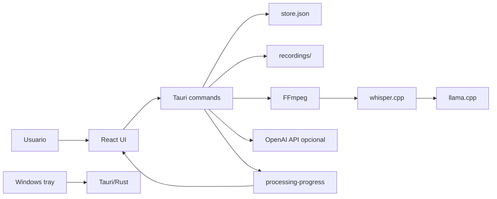
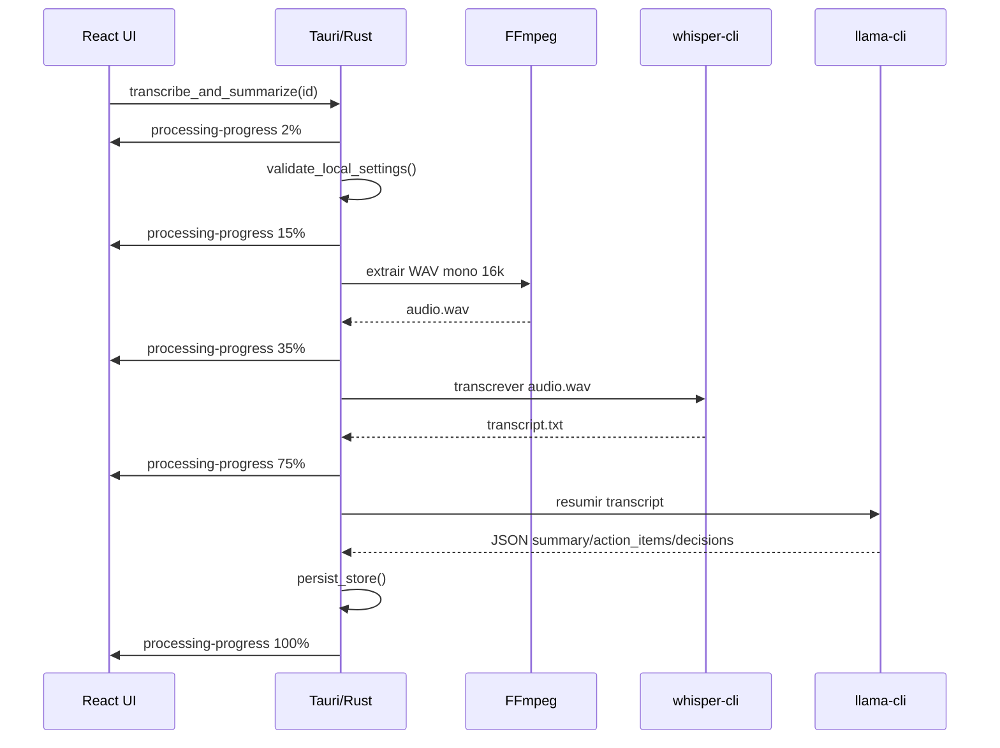

# Arquitetura

## Stack

- Frontend: React 19, TypeScript, Vite e lucide-react.
- Desktop shell: Tauri 2.
- Backend local: Rust com comandos Tauri.
- Persistencia atual: JSON local em `app_data_dir()/store.json`.
- Midia: videos locais em `app_data_dir()/recordings`.
- Processamento temporario: `app_data_dir()/processing/<meeting-id>`.
- IA local: FFmpeg, whisper.cpp e llama.cpp.
- IA API: OpenAI opcional, usada apenas nos modos `api` e `hybrid`.

## Componentes

## Frontend

Arquivo principal: `src/App.tsx`.

Responsabilidades:

- Gerenciar views: dashboard, biblioteca, categorias/tags, configuracoes, video/qualidade e integracoes.
- Iniciar e parar gravacao com WebView2 APIs.
- Converter blob gravado em bytes e enviar ao backend.
- Invocar comandos Tauri para persistencia, processamento e janela.
- Escutar eventos de tray e progresso.
- Renderizar player local com `convertFileSrc`.

## Backend Tauri

Arquivo principal: `src-tauri/src/lib.rs`.

Comandos expostos:

- `list_meetings`
- `get_settings`
- `save_settings`
- `save_recording`
- `update_meeting_title`
- `update_meeting_metadata`
- `delete_meeting`
- `open_recording`
- `reveal_recording`
- `transcribe_and_summarize`
- `minimize_window`
- `toggle_maximize_window`
- `hide_window`
- `start_dragging_window`

## Persistencia

O backend carrega e salva um `Store` contendo:

- `meetings: Vec<Meeting>`
- `settings: Settings`

O arquivo fica no diretorio de dados do app definido pelo Tauri. No Windows, isso normalmente aponta para `%APPDATA%\\com.julio.meetingvault\\store.json`.

## Pipeline local

## Pipeline API

Usado quando `processingMode` e `api`, ou quando `hybrid` falha localmente e ha API key configurada.

- Transcricao: `POST https://api.openai.com/v1/audio/transcriptions`.
- Resumo: `POST https://api.openai.com/v1/chat/completions`.

## Tray e janela

O tray e configurado por `setup_tray`. Eventos de menu emitem eventos para o frontend:

- `tray-open-library`
- `tray-start-recording`
- `tray-stop-recording`

A janela principal usa `decorations: false` em `src-tauri/tauri.conf.json`, com controles customizados no frontend.

## Pontos de atencao

- O app ainda usa `store.json`; concorrencia e integridade devem ser revistas antes de bibliotecas grandes.
- O pipeline local executa processos externos e depende de caminhos corretos.
- Modelos GGUF grandes precisam de memoria livre suficiente e contexto adequado.
- Os campos de configuracao local devem ser tratados como estado de maquina do usuario, nao como dados de projeto versionados.
