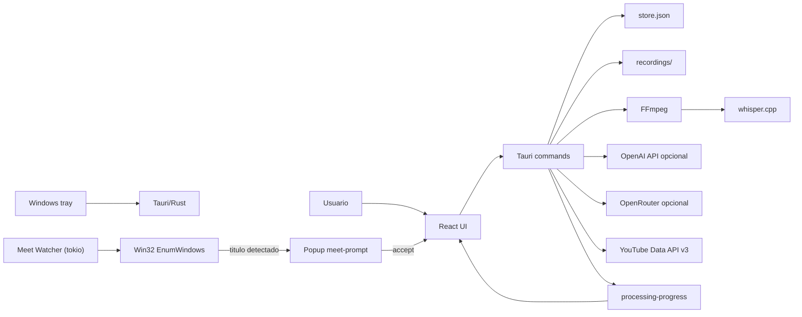
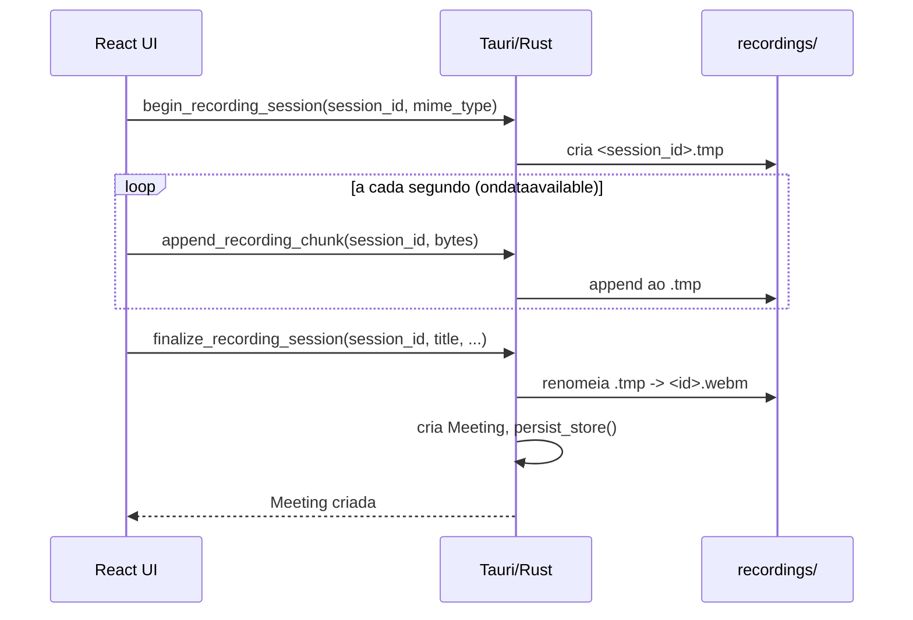
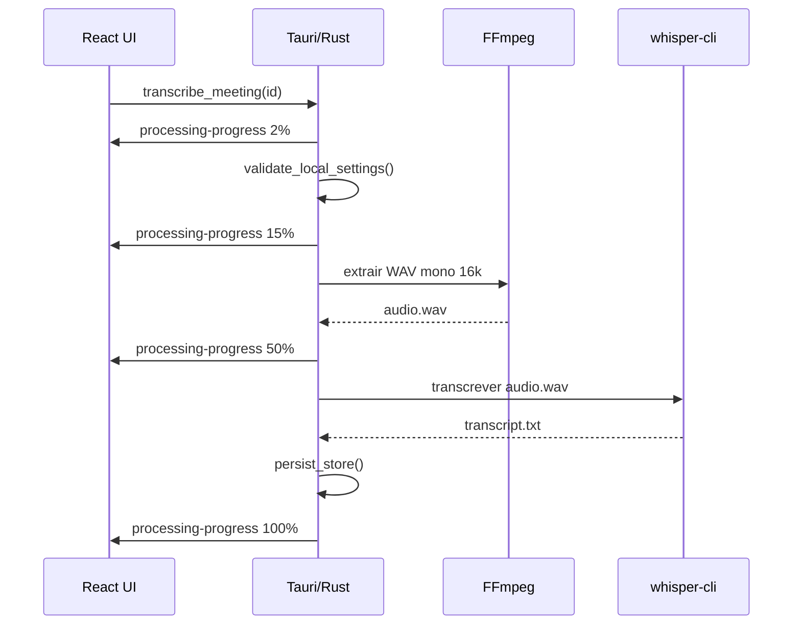
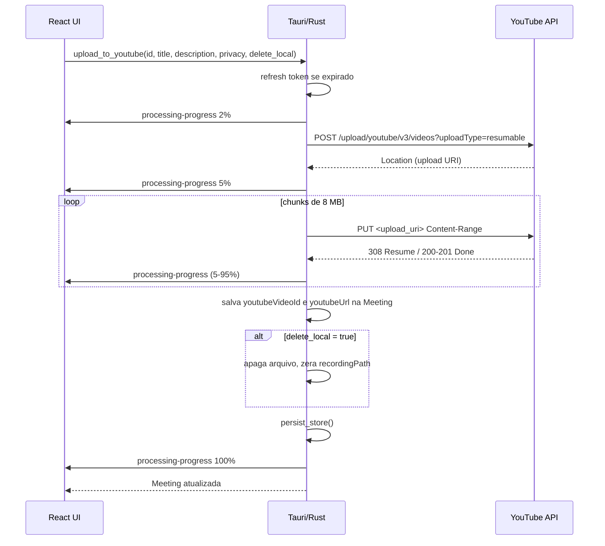

# Arquitetura

## Stack

- Frontend: React 19, TypeScript, Vite e lucide-react.
- Desktop shell: Tauri 2.
- Backend local: Rust com comandos Tauri.
- Persistencia atual: JSON local em `app_data_dir()/store.json`.
- Midia: videos locais em `app_data_dir()/recordings`.
- Processamento temporario: `app_data_dir()/processing/<meeting-id>`.
- IA local: FFmpeg e whisper.cpp.
- IA API: OpenAI opcional, usada apenas nos modos `api` e `hybrid` para transcricao.
- Resumo API: OpenRouter opcional, usado apenas quando `summaryMode` e `openrouter`.

## Componentes

## Frontend

Arquivo principal: `src/App.tsx`.

Componentes globais:

- `src/components/ConfirmDialog.tsx`: modal reutilizavel para confirmacoes destrutivas.
- `src/components/IntegrationsView.tsx`: pagina de integracoes (YouTube configurado, Notion planejado). Autonomo — chama `invoke` diretamente para `save_settings`, `connect_youtube` e `disconnect_youtube` (excecao documentada: fluxo OAuth exige sequencia atomica local ao componente).
- `src/components/YoutubeUploadDialog.tsx`: modal para publicar gravacao no YouTube (titulo, descricao, privacidade, opcao de apagar local).
- `src/components/MeetDetectedPrompt.tsx`: prompt de deteccao de reuniao Google Meet. Exibido na janela popup separada (`meet-prompt`) com countdown de 15s, botoes "Iniciar gravacao" e "Ignorar", barra de progresso animada. Aceita prop `standalone` para modo popup (sem `position: fixed`).

Raizes alternativas:

- `src/MeetPromptApp.tsx`: componente raiz renderizado exclusivamente na janela popup `meet-prompt`. Detecta `?mode=meet-prompt&title=<encoded>` na URL, aplica `background: transparent` ao body e renderiza `MeetDetectedPrompt` em modo standalone.

Diretriz de componentizacao:

- `App.tsx` deve evoluir para um orquestrador: estado de alto nivel, selecao de views, eventos Tauri e callbacks de comandos.
- Novas experiencias visuais relevantes devem ser criadas como componentes React separados sempre que tiverem estado proprio, fluxo proprio, JSX extenso ou potencial de reuso.
- Componentes globais e reutilizaveis ficam em `src/components/`.
- Componentes especificos de uma view devem ser organizados por dominio quando forem extraidos, por exemplo `src/components/library/` ou `src/components/settings/`.
- Props devem ser explicitas e tipadas; componentes nao devem chamar Tauri diretamente quando puderem receber callbacks do container.
- CSS continua centralizado em `src/styles.css` ate existir decisao formal de modularizacao de estilos.

Responsabilidades do `App.tsx`:

- Gerenciar views: dashboard, biblioteca, categorias/tags, configuracoes, video/qualidade e integracoes.
- Iniciar e parar gravacao via pipeline de streaming (begin/append/finalize).
- Invocar comandos Tauri para persistencia, processamento e janela.
- Escutar eventos de tray, progresso, `youtube-connected` e `meet-start-recording`.
- Renderizar player local com `convertFileSrc`.
- Iniciar o meet watcher (`start_meet_watcher`) no startup.

## Backend Tauri

Arquivo principal: `src-tauri/src/lib.rs`.

Comandos expostos:

**Reunioes e configuracoes:**
- `list_meetings`
- `get_settings`
- `save_settings`
- `update_meeting_metadata`
- `delete_meeting`
- `open_recording`
- `reveal_recording`
- `transcribe_meeting`
- `summarize_meeting`

**Gravacao em streaming (substituem `save_recording`):**
- `begin_recording_session` — cria `<session_id>.tmp` em `recordings/`
- `append_recording_chunk` — anexa bytes ao `.tmp`
- `finalize_recording_session` — renomeia para `.webm`, cria `Meeting`, persiste
- `cancel_recording_session` — apaga `.tmp` sem criar `Meeting`

**YouTube:**
- `get_youtube_connection_status` — retorna `bool` (refresh_token nao-vazio)
- `connect_youtube` — OAuth 2.0: abre browser, escuta `127.0.0.1:8765` (timeout 120s), troca code por tokens, emite evento `youtube-connected`
- `disconnect_youtube` — limpa `YoutubeTokens` no store
- `upload_to_youtube` — upload em chunks de 8 MB via Resumable Upload API, emite `processing-progress`, salva `youtubeVideoId` e `youtubeUrl` na reuniao
- `delete_local_recording` — apaga arquivo local, zera `recordingPath`
- `open_url` — abre URL no browser padrao via `cmd /c start`

**Google Meet detection:**
- `start_meet_watcher` — inicia background task tokio que faz polling de titulo de janela Win32 a cada 3s; ao detectar Meet, cria janela popup `meet-prompt` always-on-top
- `stop_meet_watcher` — desativa o polling
- `accept_meet_prompt` — fecha popup, traz janela principal ao foco, emite `meet-start-recording` para o frontend pre-preencher titulo e iniciar gravacao
- `dismiss_meet_prompt` — fecha popup sem acao

**Janela:**
- `minimize_window`
- `toggle_maximize_window`
- `hide_window`
- `start_dragging_window`

## Persistencia

O backend carrega e salva um `Store` contendo:

- `meetings: Vec<Meeting>`
- `settings: Settings`
- `youtube_tokens: YoutubeTokens` — `{ access_token, refresh_token, expires_at: i64 }` — nunca logado nem versionado

Todos os campos novos usam `#[serde(default)]` para compatibilidade retroativa com `store.json` existentes.

O arquivo fica no diretorio de dados do app definido pelo Tauri. No Windows, isso normalmente aponta para `%APPDATA%\\com.julio.meetingvault\\store.json`.

## Pipeline de captura de audio

A gravacao mistura duas fontes de audio via Web Audio API:

1. `getDisplayMedia` com `audio: settings.captureSystemAudio` — captura audio da tela/sistema quando a fonte permitir.
2. `getUserMedia({ audio: true })` com `audio: settings.captureMicrophone` — captura o microfone do usuario.

Se ambas as fontes estiverem ativas, um `AudioContext` cria um `MediaStreamDestination` ao qual as duas sao conectadas. O `MediaRecorder` recebe um `MediaStream` composto pelas faixas de video da tela e a faixa de audio mixada. Se a permissao do microfone for negada, a gravacao continua sem microfone (fallback silencioso).

Refs mantidos: `micStreamRef` e `audioCtxRef` — limpos no `onstop`.

## Pipeline de gravacao (streaming)

## Pipeline local (transcricao)

## Pipeline YouTube (upload)

## Pipeline API

Usado quando `processingMode` e `api`, ou quando `hybrid` falha localmente e ha API key configurada.

- Transcricao: `POST https://api.openai.com/v1/audio/transcriptions`.

## Pipeline de resumo OpenRouter

Resumo e separado da transcricao. O comando `summarize_meeting(id)` exige uma transcricao existente, `summaryMode = openrouter`, chave OpenRouter e um ID de modelo configurado.

- Endpoint: `POST https://openrouter.ai/api/v1/chat/completions`.
- Modelos: configuraveis por ID, por exemplo `arcee-ai/trinity-large-thinking:free`.
- Transcricoes longas sao divididas em partes; o backend resume cada parte e consolida um resumo final.
- O resultado e salvo em `Meeting.summary` no `store.json`.
- A operacao emite `processing-progress` e usa o status `processing` durante a geracao.

## Tray e janela

O tray e configurado por `setup_tray`. Eventos de menu emitem eventos para o frontend:

- `tray-open-library`
- `tray-start-recording`
- `tray-stop-recording`

A janela principal usa `decorations: false` em `src-tauri/tauri.conf.json`, com controles customizados no frontend.

## Modelo de dados — Meeting

| Campo | Tipo | Notas |
|---|---|---|
| `id` | `String` | UUID |
| `title` | `String` | editavel |
| `createdAt` | `String` | ISO 8601 |
| `startedAt` | `String` | ISO 8601 |
| `category` | `String` | livre |
| `tags` | `Vec<String>` | normalizadas |
| `durationSeconds` | `u64` | |
| `sizeBytes` | `u64` | |
| `recordingPath` | `String` | vazio se arquivo apagado apos upload YouTube |
| `mimeType` | `String` | |
| `transcript` | `String` | |
| `summary` | `String` | gerado via OpenRouter |
| `status` | `String` | `recorded`, `processing`, `completed`, `error` |
| `progressMessage` | `String` | |
| `progressPercent` | `u8` | |
| `error` | `String` | |
| `youtubeVideoId` | `String` | vazio = nao publicado |
| `youtubeUrl` | `String` | vazio = nao publicado |

## Pontos de atencao

- O app ainda usa `store.json`; concorrencia e integridade devem ser revistas antes de bibliotecas grandes.
- O pipeline local executa processos externos e depende de caminhos corretos.
- Os campos de configuracao local devem ser tratados como estado de maquina do usuario, nao como dados de projeto versionados.
- Dados antigos no `store.json` com `action_items` e `decisions` continuam ignorados silenciosamente. O campo `summary` voltou a ser ativo para resumos OpenRouter.
- `youtube_tokens` no `store.json` contem tokens OAuth sensiveis — nunca logar, nunca versionar.
- O OAuth listener na porta 8765 expira em 120s. Se o usuario fechar o browser sem autorizar, o fluxo expira graciosamente via `recv_timeout`.
- Meet watcher usa `AtomicBool` para controle de ciclo de vida — garantia de que apenas uma instancia do watcher roda por vez.
- A janela popup `meet-prompt` tem label proprio em `capabilities/default.json` — novas janelas Tauri precisam ser registradas la tambem.
- Captura de microfone exige permissao do usuario no Chrome (solicitada na primeira gravacao). O `AudioContext` e fechado no `onstop` para evitar vazamento de recursos.
